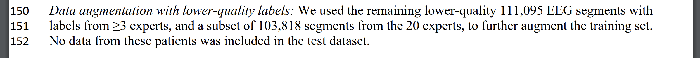
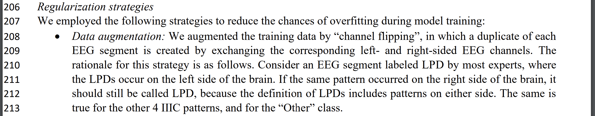
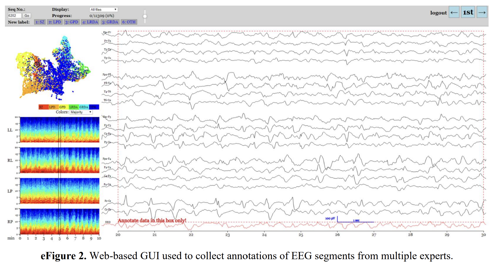
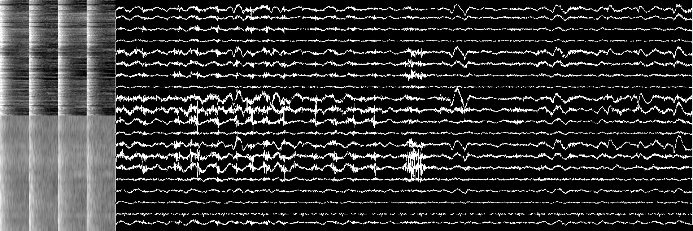

# Overview

Here is the high level description of my solution for 16th place in the HMS - Harmful Brain Activity Classification competition. 

- **Data:** competition's 10min & @cdeotte's (big thanks to him!) 50s spectrograms concatenated with plots of normalized EEG bipolar montages
- **Model:** timm's tinyViT as a backbone (the best quality / speed ratio)
- **Training:** stage 1 training with only > 7 voters, stage 2 by pseudolabeling (PL) the rest of the data & re-training
- **Augmentations:** random selection of EEG-sub-id, channel flipping of left-side and right-side electrodes in raw EEGs and spectrograms, image augs: coarse dropout + brightness / contrast
- **Other:** cosine LR schedule w warm-up, EMA with decay 0.8, TTA by flipping

The final solution is 6 seeds ensemble on all the data (> 7 labels, <= 7 PLs), PLs for <= 7 voters part was also obtained by 10-seeds ensemble.

The most helpful parts were selecting only quality labels with > 7 voters, plotting 1D as 2D, using global bipolar montages' normalization instead of per-object min-max, luck of the backbone selection and using large image size. PLs, usage of EMA and TTA introduced only minor (~0.001 order of magnitude) improvements. I have not properly measured the augmentations impact and only could state that adding them greatly reduced overfitting.

# Some insights from the papers

The following supplementary materials [paper](https://cdn-links.lww.com/permalink/wnl/c/wnl_2023_02_26_westover_1_sdc1.pdf) helped with two things: 

1. Answer to the question: does test data contain only objects with high number of voters?


 
2. Channel flipping augmentation.



Another thing covered here was train-test splitting strategy based on errors' equalization that could help to have more equal distribution of the hard samples in train and test, but I have not used it, sticking to the familiar `StratifiedGroupKFold`.

# Data

Here, the idea was to leverage 2D vision models and weights (esp. transformers architecture) and simultaneously show the model just the same picture as which was shown to the voters when they were labeling the data. 



That was achieved by converting everything in 2D as follows:

Competition's data spectrograms with the following pre-processing:

```
    spectrogram[np.isnan(spectrogram)] = 0
    spectrogram = np.log10(spectrogram + 1e-6)
    min_, max_ = np.quantile(spectrogram, 0.01), np.quantile(spectrogram, 0.99)
    spectrogram = np.clip(spectrogram, min_, max_)
    spectrogram = (spectrogram - min_) / (max_ - min_)
```

And @cdeotte's spectrograms with no additional pre-processing other than converting to [0, 1] range. Both specs were resized to 320 x 320 and concatenated vertically.

Next, EEG bipolar montages of central 20s were calculated, filtered in 1-70 Hz range excluding possible power line noise and normalized. Pre-calculated `EEG_DIFF_ABS_MAX[i]` values are mostly around 100 as 0.05 and 0.95 quantiles of the corresponding montages.

```
    # Remove 50 Hz & 60 Hz noise
    b, a = butter(5, (59, 61), btype='bandstop', analog=False, fs=EED_SAMPLING_RATE_HZ)
    y = lfilter(b, a, y, axis=0)

    # Bandpass 1-70 Hz
    b, a = butter(5, (1, 70), btype='bandpass', analog=False, fs=EED_SAMPLING_RATE_HZ)
    y = lfilter(b, a, y, axis=0)

    # Normalize
    min_, max_ = \
        -2 * EEG_DIFF_ABS_MAX[i], \
        2 * EEG_DIFF_ABS_MAX[i]
    y = np.clip(y, min_, max_)
    y = (y - min_) / (max_ - min_)
    y[0] = 0
    y[-1] = 1
```

The 20 resulting montages were plotted to 2D array of size 640 x 1600 by `justpyplot` library, each covers up to 64 x 1600 area with overlaps and concatenated to the spectrograms. The total image size was 640 x 1920, find an example of the image below.



# Model

Initially I have selected the `tiny_vit_21m_512.dist_in22k_ft_in1k` model to experiment with as indeed tiny and fast to train. At some moment I have tried to use some other models, but it appears that it was distilled to be very powerful, so to reach its performance I needed e.g. `hf_hub:timm/eva02_base_patch14_448.mim_in22k_ft_in22k_in1k` model, which is ~ 5 times larger and much slower. 

So, I could only recommend trying the mentioned TinyViT model in your problems!

# Solution reproduction

## Seeds

```
python run/main.py fit --config run/configs/common.yaml --config run/configs/timm_vit_tiny.yaml --data.init_args.only_train true --seed_everything 28490463; \
python run/main.py fit --config run/configs/common.yaml --config run/configs/timm_vit_tiny.yaml --data.init_args.only_train true --seed_everything 28123213; \
python run/main.py fit --config run/configs/common.yaml --config run/configs/timm_vit_tiny.yaml --data.init_args.only_train true --seed_everything 285675463; \
python run/main.py fit --config run/configs/common.yaml --config run/configs/timm_vit_tiny.yaml --data.init_args.only_train true --seed_everything 28446341235; \
python run/main.py fit --config run/configs/common.yaml --config run/configs/timm_vit_tiny.yaml --data.init_args.only_train true --seed_everything 28491236524; \
python run/main.py fit --config run/configs/common.yaml --config run/configs/timm_vit_tiny.yaml --data.init_args.only_train true --seed_everything 1235666234; \
python run/main.py fit --config run/configs/common.yaml --config run/configs/timm_vit_tiny.yaml --data.init_args.only_train true --seed_everything 38765223; \
python run/main.py fit --config run/configs/common.yaml --config run/configs/timm_vit_tiny.yaml --data.init_args.only_train true --seed_everything 45757854; \
python run/main.py fit --config run/configs/common.yaml --config run/configs/timm_vit_tiny.yaml --data.init_args.only_train true --seed_everything 98744522; \
python run/main.py fit --config run/configs/common.yaml --config run/configs/timm_vit_tiny.yaml --data.init_args.only_train true --seed_everything 567857687; \
python run/main.py fit --config run/configs/common.yaml --config run/configs/timm_vit_tiny.yaml --data.init_args.only_train true --seed_everything 684355834
```

*Note: seed 28446341235 and seed 28491236524 somehow yield same results, so 28446341235's predictions are not used as PLs (`submission_2.csv` is not included in `pl_filepathes`) and the seed is not used for training with PLs.*

Resulting models (`ema-0.8_$i.ckpt`) are moved to `tmp/` dir.

## Pseudolabels generation

```
for i in {0..10}; do python run/main.py         predict         --config run/configs/common.yaml         --config run/configs/timm_vit_tiny.yaml         --model.init_args.tta true     --data.init_args.by_subrecord true --data.init_args.test_is_train true --data.init_args.low_n_voters_strategy low --data.init_args.only_train true    --ckpt_path tmp/ema-0.8_$i.ckpt; mv submission.csv submission_$i.csv; done
```

Resulting PLs (`submission_$i.csv`) files are moved to `labels/pseudolabel/` dir.

## Seeds with PL

```
for s in 28490463 28123213 285675463 28491236524 1235666234 38765223 45757854 98744522 567857687 684355834; do python run/main.py fit --config run/configs/common.yaml --config run/configs/timm_vit_tiny.yaml --data.init_args.only_train true --data.init_args.low_n_voters_strategy both --data.init_args.pl_other_vote_threshold 0.8 --data.init_args.pl_filepathes '["labels/pseudolabel/submission_0.csv", "labels/pseudolabel/submission_1.csv", "labels/pseudolabel/submission_3.csv", "labels/pseudolabel/submission_4.csv", "labels/pseudolabel/submission_5.csv", "labels/pseudolabel/submission_6.csv", "labels/pseudolabel/submission_7.csv", "labels/pseudolabel/submission_8.csv", "labels/pseudolabel/submission_9.csv", "labels/pseudolabel/submission_10.csv"]' --seed_everything $s; done
```
